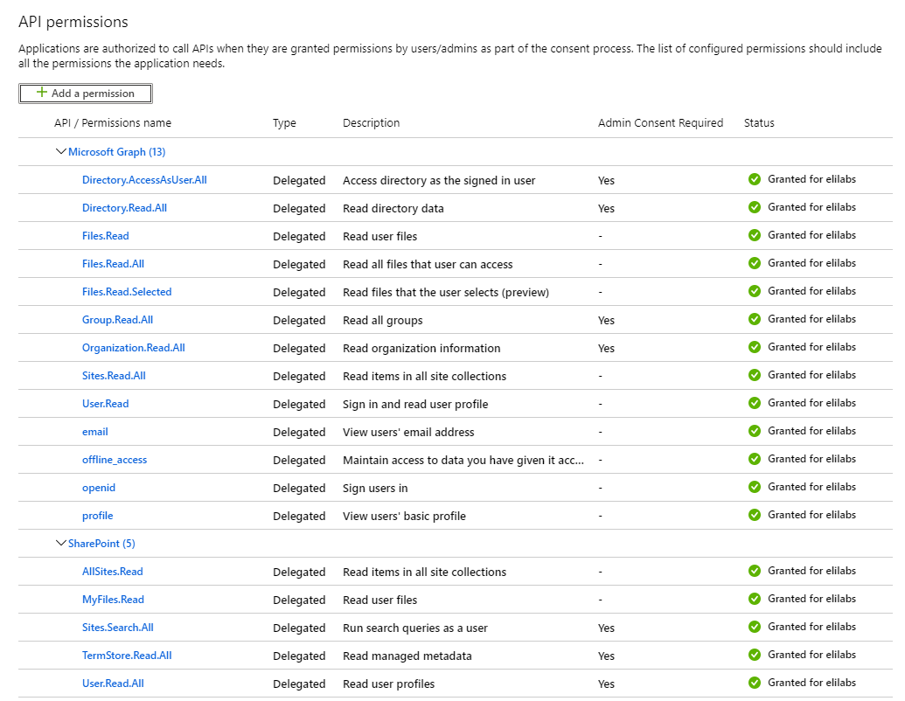
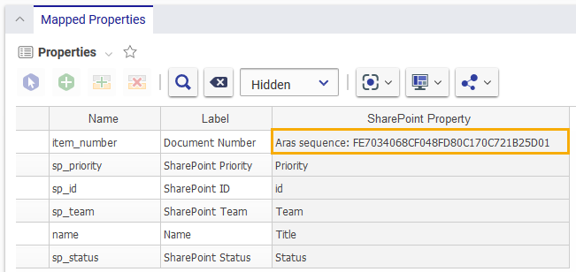
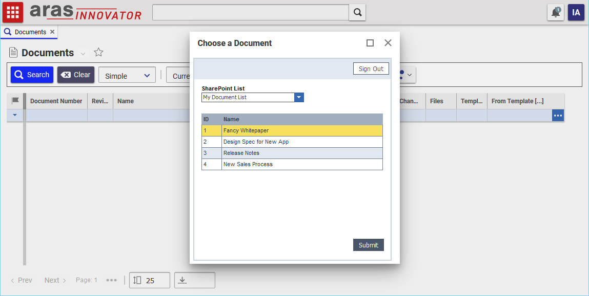
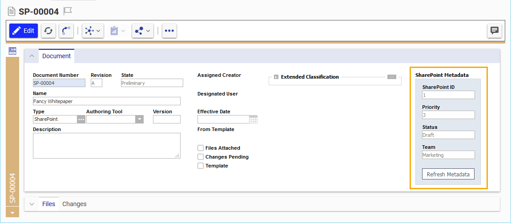

# SharePoint Integration Example

This project takes advantage of the Microsoft Graph API to create a simple integration between Aras Innovator and SharePoint. 

The following use cases are currently implemented:

1. Aras admins can define a mapping between the metadata of SharePoint list items and the properties of an Aras Innovator ItemType.
2. End users can run an action on an ItemType to search for a SharePoint item and create a new instance of the Aras ItemType.
3. End users can refresh the SharePoint metadata displayed in the Aras item form to get the latest values.

The following use cases are planned for future releases:

1. Server-side functionality for syncing SharePoint metadata via the Aras Scheduler Service
2. Syncing physical files from SharePoint to the Aras vault
3. Updating SharePoint items with Aras item metadata
4. Additional authentication examples - application/service user authentication with the MS Graph API, server-side authentication


## History

Release | Notes
--------|--------
[v1.0.0](https://github.com/ArasLabs/sharepoint-example/releases/tag/v1.0.0) | 

#### Supported Aras Versions

Project | Aras
--------|------
[v1.0.0](https://github.com/ArasLabs/sharepoint-example/releases/tag/v1.0.0) | 


## Installation

#### Important!
**Always back up your code tree and database before applying an import package or code tree patch!**

### Pre-requisites

1. Aras Innovator installed
2. Aras Package Import Utility
3. aras.labs.SharePointConfiguration package
4. Code Tree overlay
5. Administrator access to an Office 365 tenant

### Install Steps

#### The Office 365 Tenant
In order to send requests to the Microsoft Graph API, we need to register an application with the Office 365 tenant. This allows us to grant permissions and request access tokens without opening up too much access to the SharePoint data. The following application configuration steps are based on [this Microsoft documentation](https://docs.microsoft.com/en-us/graph/auth/auth-concepts). You can find more information [here](https://docs.microsoft.com/en-us/graph/auth-register-app-v2).

1. Go to your [Azure Portal](https://portal.azure.com/) and login as an administrator for the Office 365 tenant.
2. Go to **Azure Active Directory > App registrations > New registration**.
3. Enter a name, account type, and redirect URI. 
   * The redirect URI should point to the Innovator/Client/scripts/blank.html file in your Innovator instance. Ex: http://localhost/12POC/Client/scripts/blank.html
4. Go to **API Permissions** and grant the permissions shown below. Be sure to grant admin permissions for all requested permissions.
   
    

5. Save your application registration.

#### The Code Tree
1. Backup your code tree and store the backup in a safe place.
2. Copy the `..\sharepoint-example\CodeTree\Innovator\` folder in your local repository.
3. Paste this folder to the root of your code tree.
	* This should be the same folder that contains the `InnovatorServerConfig.xml`.
4. Add the following line to `Innovator\Client\Modules\aras.innovator.core.Form\Views\FormInstance.cshtml` in your Innovator installation.
    ```html
    <script type="text/javascript" src="@Url.ContentWithSalt("~/javascript/include.aspx?classes=ArasModules,ItemProperty&files=TopWindowHelper")"></script>
    <script type="text/javascript" src="@Url.ContentWithSalt("~/Modules/aras/field.js")"></script>
    <!-- added for sharepoint integration -->
    <script type="text/javascript" src="@Url.ContentWithSalt("~/scripts/SharePoint/msal.js")"></script>
    ```

#### The Database
1. Backup your database and store the BAK file in a safe place.
2. Open up the Aras Package Import tool.
3. Enter your login credentials and click **Login**
    * _Note: You must login as root for the package import to succeed!_
4. Enter the package name in the TargetRelease field.
    * Optional: Enter a description in the Description field.
5. Enter the path to your local `..\sharepoint-example\Import\SharepointConfiguration\imports.mf` file in the Manifest File field.
6. Select the following in the Available for Import field.
    * **aras.labs.SharePointConfiguration**
7. Select Type = **Merge** and Mode = **Thorough Mode**.
8. Click **Import** in the top left corner.
9.  Close the Aras Package Import tool.

**Optional:** 
This community project also contains an optional package that adds some properties to the OOTB Document ItemType and Form, as well as a Sequence item for generating unique document numbers for items synced from SharePoint. You can import the `..\sharepoint-example\Import\ExampleImplementation\imports.mf` file following steps 1-9 above if you would like to try out this example. 

If you would like to configure a different ItemType or you want more control over the properties and form fields that are added, you can skip this section and follow the **Configuring Your Aras ItemType** section below.

### Configuration Steps

#### Configuring Your ItemType
This section outlines how you can configure any ItemType to work with this community project. If you imported the optional Example Implementation package, you can skip this section and move on to **Configuring the SharePoint Mapping**.

1. Login to Innovator as admin.
2. Navigate to **Administration > ItemTypes** in the TOC and search for the ItemType you want to integrate with SharePoint. Open it for editing.
3. If you want to assign a specific classification to items synced from SharePoint, click the **Class Structure** button and add the classification in the dialog. Close the dialog when you're done.
4. Add properties for any metadata properties you want to sync from SharePoint. 
    * If you added a classification in step 3, select that classification as the class path for each property you add in step 4.
5. Select the **Actions** relationship tab and add the **labs_NewItemFromSharePoint** action.
6. Save the ItemType.

#### Configuring Your Form
1. Select the **Views** relationship tab and open the ItemType's form for editing.
2. Add fields to the form for each metadata property you want to display.
    * Tip: For organizational purposes, it's helpful to prefix the name of each field with something to identify them as SharePoint metadata fields.
    * Tip: Be sure to disable the fields (select "Disable" under the **Field Physical** tab), that way users understand that the data is read-only from SharePoint and cannot be updated from Innovator.
3. Add a button field to allow the user to refresh the metadata properies from SharePoint.
4. Under the **Field Events** tab, add the **labs_UpdateSharePointMetadata** method as an onClick event for your button field.
5. Under the **Form Events** tab, add the **labs_ShowSharePointFields** method as an onFormPopulated event.
6. Open the **labs_ShowSharePointFields** method for editing.
7. In the fieldNames array, replace the example field names with the names of the metadata fields you added to your form.
8. Save and close the method.
9. Save and close the form.

#### Configuring the SharePoint Mapping
1. Navigate to **Administration > SharePoint Configurations** in the TOC and create a new SharePoint Configuration item.
2. Enter a name for your configuration item, as well as the SharePoint site url. The format should look like this: https://{host}/sites/{site name}.
3. Copy the **Application (client) ID** field from your app registration in your Azure dashboard and paste it into the Client ID field of the configuration item.
4. Copy the **Directory (tenant) ID** field from your app registration and paste it into the Tenant ID field.
5. In the ItemType field, choose the type of item you want to map to SharePoint metadata.
6. If you want items mapped to SharePoint to have a certain classification, enter it in the Classification field.
7. In the Mapped Properties grid, add the item properties that you want to map to SharePoint metadata and enter the names of the SharePoint properties.
    * Note: If you want to assign a unique Aras sequence value to a property on the Aras item, you can use the following syntax. "Aras sequence: {id}"

    

8. Save and close the SharePoint Configuration item.

## Usage

### Creating a new Aras item from SharePoint metadata



1. Login to Innovator.
2. In the TOC, navigate to the ItemType that you've mapped to SharePoint.
3. Right click anywhere in the search grid area and select **Create Document from SharePoint**.
4. Click the **sign in** button in the top right corner of the dialog and enter your SharePoint credentials.
    * You'll only need to do this the first time you run the action after logging into Innovator.
    * If you've signed into SharePoint inside of Innovator before but not in the current session, the dialog will briefly appear and then disappear. This is a known issue with this release. Just run the action again as a workaround and you'll be able to login as expected.
5. In the SharePoint List dropdown field, select the list you want to pick an item from.
6. Once the table populates, select the item you want to map to your new Innovator item and click the **submit** button.

The dialog will close and the new item will open in a new tab inside Innovator. You will be able to see the SharePoint item's metadata populated in the mapped Innovator fields.

### Updating SharePoint metadata



1. Open the item that contains mapped SharePoint data.
2. Click the **Refresh Metadata** button to update the item with the latest SharePoint metadata.


## Contributing

1. Fork it!
2. Create your feature branch: `git checkout -b my-new-feature`
3. Commit your changes: `git commit -am 'Add some feature'`
4. Push to the branch: `git push origin my-new-feature`
5. Submit a pull request

For more information on contributing to this project, another Aras Labs project, or any Aras Community project, shoot us an email at araslabs@aras.com.


## Credits

Created by Eli Donahue for Aras Labs. [@EliJDonahue](https://github.com/elijdonahue)


## License

Aras Labs projects are published to Github under the MIT license. See the [LICENSE file](./LICENSE.md) for license rights and limitations.